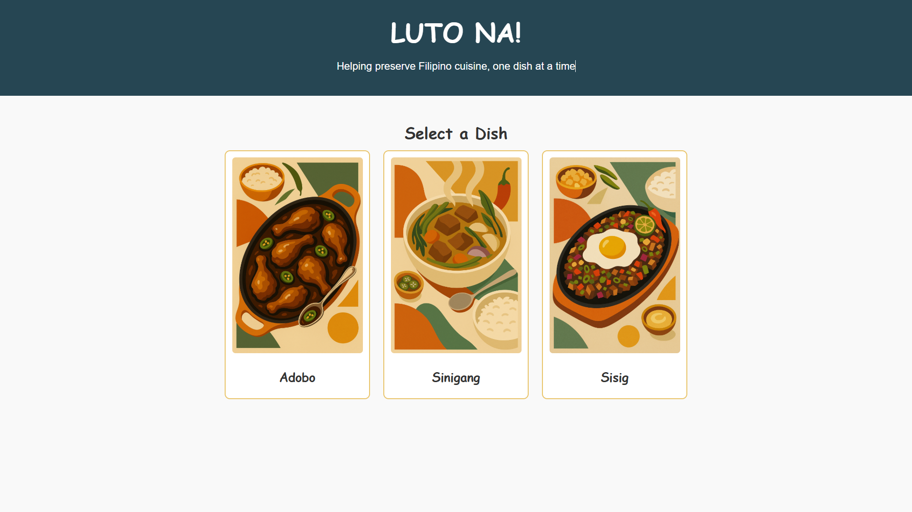
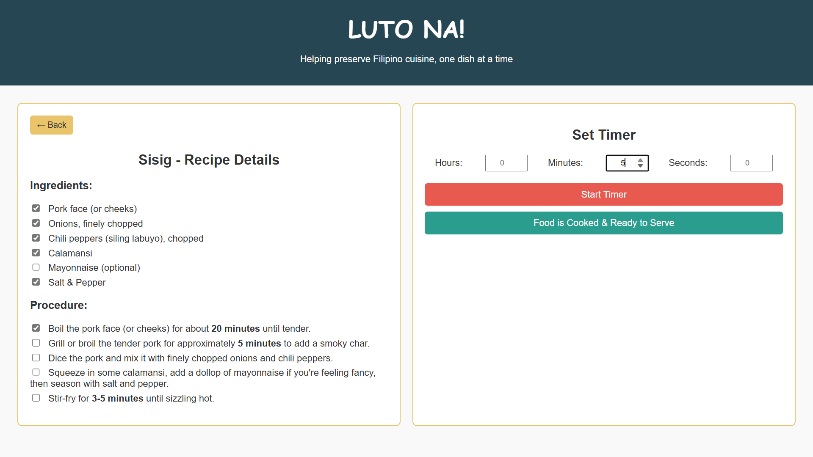
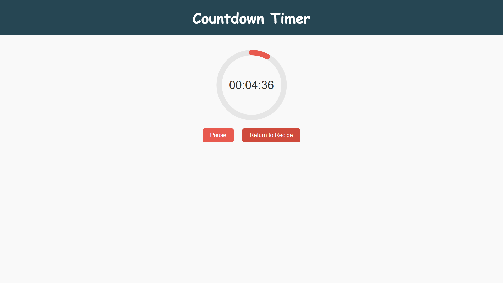

# LutoNa!

A digital culinary recipe app that combines Filipino recipes with interactive technology.

# Luto Na!

**Luto Na!** is an app that blends modern web technology with our cherished Filipino culinary traditions. It helps users—especially those who need clear, step-by-step instructions in the kitchen—follow traditional recipes while preserving the flavors of home.

---

## Overview

Luto Na! enables you to choose popular Filipino dishes (like Adobo, Sinigang, or Sisig) and guides you through every step with interactive checklists and a countdown timer. It preserves your progress using localStorage so you never lose your place—even if you need to step away momentarily.

---

## Features

- **Dish Selection:** Choose from popular Filipino dishes using an attractive card interface.
- **Interactive Recipe Details:**
  - _Detailed Step-by-Step Instructions:_ Every step is laid out.
  - _Ingredients & Procedures as Checklists:_ Mark off each ingredient and step as you follow the recipe.
- **Countdown Timer:** An animated circular progress timer helps you keep track of cooking time.
- **Persistent State:** User progress (checklists) is saved using localStorage, so you can always return to your recipe without losing progress.

---

## Screenshots

Below are sample images showing various aspects of the app.

- **Dish Selection:**

  

- **Recipe Details with Interactive Checklists:**

  

- **Countdown Timer Screen:**

  
